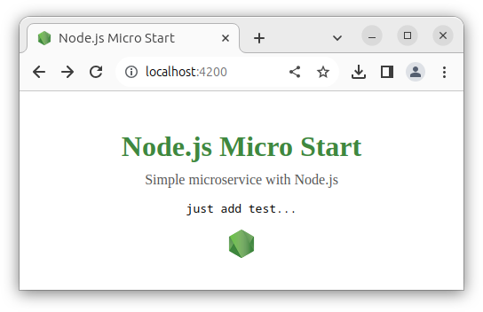

# Micro Start Node.js

Simple microservice with Node.js Vanilla and TypeScript. 

Based on `node:20.6-alpine3.18`. Built image: `184 MB`;
```shell
# run this command to start
make d-up
```

### URL addresses
- main page: `/`
- simple api: `/api`
- static file: `/download/some.txt`

> Just **_click on the logo_** to download a static file.



## Analogs
- Golang Native: [micro-start-go](https://github.com/phacman/micro-start-go)
